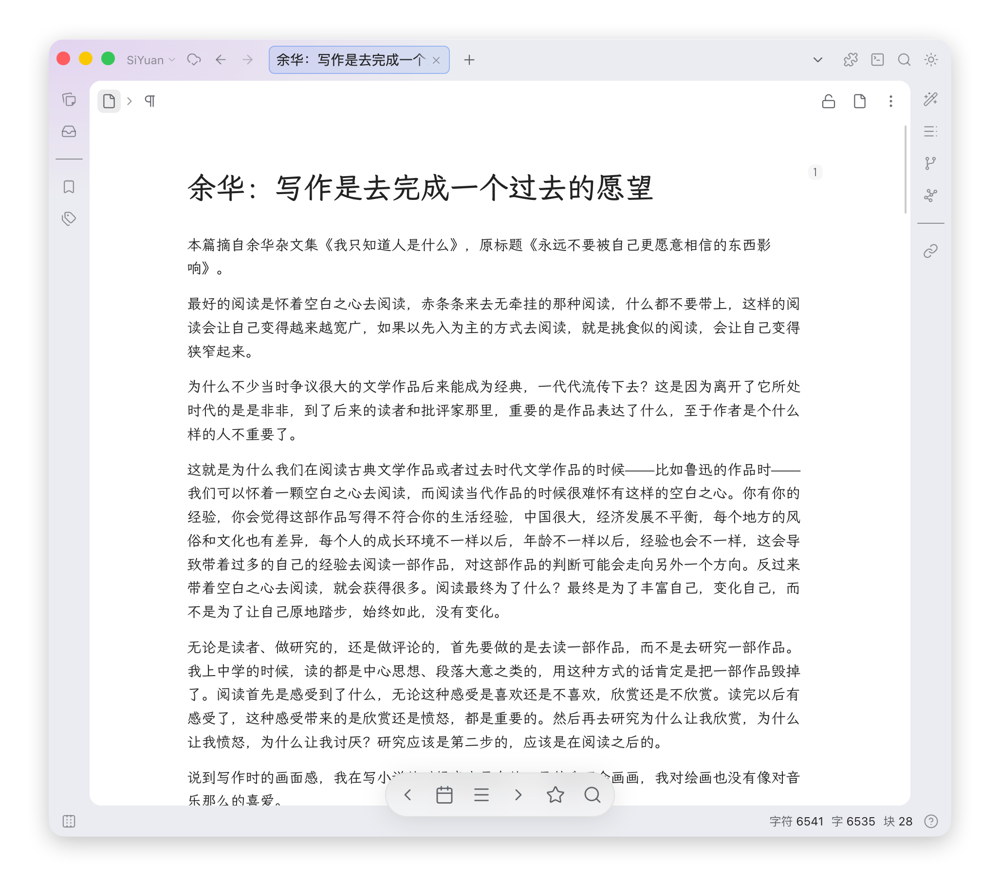

# 🐼 熊猫导航

专为思源笔记打造的移动端/桌面端自适应导航栏，让你在思源中浏览文档时操作更顺手。

## 功能亮点

- **移动端药丸导航**：底部悬浮导航栏，向下滚动时自动变身为贴边小药丸，绝不遮挡你宝贵的笔记内容；轻轻一点即可展开
- **桌面端简洁导航**：纯图标悬浮导航，鼠标悬停时优雅显示提示，界面干净清爽，不占空间
- **一键导入配置模版**：觉得从头配置太麻烦？插件自带多款精美“预设模版”（比如超级好用的九宫格基础导航），一键导入，新手也能瞬间上手
- **像搭积木一样的自由菜单**：彻底打破死板的层级限制，你可以自由创建分组（还能设为网格模式），把喜欢的操作塞进去，想怎么排就怎么排
- **标签文字开关**：嫌文字太多？你可以自由控制按钮下方是否显示文字，电脑端和手机端还能分开设置
- **多端设备独立控制**：你可以让某个按钮“仅在手机端显示”，或者“仅在电脑端显示”，完美适配不同设备的阅读习惯

## 快速开始

集市上架审核中，你可以通过以下方式安装：

- 使用[安装集市包插件](https://github.com/TCOTC/install-package)，输入 `hqweay/siyuan-panda-navigation` 安装
- 或[直接下载 package.zip](https://github.com/hqweay/siyuan-panda-navigation/releases/download/0.2.0/package.zip)，解压后放入思源笔记插件目录

## 轻松配置

### 基础外观设置
- **启用悬浮导航栏**：自由选择是在手机端、电脑端还是两端同时显示导航栏。
- **按钮标签文字**：随时控制按钮下方是否显示文字说明。

### 高级玩法与重置
- **导入预设**：不知道怎么布局好看？直接在设置里选择“基础导航网格”等预设，一键拥有完美排版。
- **恢复默认配置**：如果平时折腾菜单不小心弄乱了，可以在预设下拉框里找到这个选项，点一下就能瞬间恢复出厂设定，不用有任何心理负担。

### 快捷动作与分组组合

你可以把常用操作做成“动作”，或者把它们丢进“分组”里折叠起来。插件支持的超强操作类型：

| 类型 | 说明 |
|------|------|
| **内置功能 (Builtins)** | 插件自带的超级加强版功能，包括： • **自定义链接/文档ID**：快速打开外部网页或思源某篇文档 • **随机漫游 (SQL)**：用自定义 SQL 从浩瀚的笔记海里随机翻阅 • **文档层级漫游**：快速跳转父级、子级、相邻文档等 • **添加到数据库**：一键把当前文章塞进你指定的属性视图里 |
| **系统命令 (System)** | 直接触发思源笔记本体自带的任意系统快捷命令 |
| **第三方命令 (Plugin)** | 神仙功能！能直接触发你安装的**其他思源插件**里注册的任意命令（例如一键打开“今日日记”等） |

## 🛠 给开发者：如何扩展“内置功能”？

现在熊猫导航的内置命令模块彻底采用了**无感知的注册表模式（Registry Pattern）**。如果你有任何天马行空的想法，并想把它加入到熊猫导航的“内置功能”里，极其简单：

1. 进入 `src/builtins/commands/` 目录。
2. 新建一个 `.ts` 文件。
3. 实现 `BuiltinCommand` 接口（可以参考同目录下的 `url.ts` 或 `document.ts`），并把它 `export` 出来。
   
**就这么简单！** 哪怕你导出的是一个数组，底层的 Vite `import.meta.glob` 引擎也会在编译时**全自动扫描并注册**。从此告别痛苦的中央文件维护，完全解耦你的贡献代码。

## 使用提示

- 移动端长按无标签的按钮会显示名称提示
- 导航栏上的「快捷操作」按钮可以展开子菜单，里面放不常点但偶尔要用到的动作
- 桌面端导航栏始终显示，不会跟随滚动隐藏

## 反馈

遇到问题或有建议，欢迎在 GitHub 提交 Issue。
